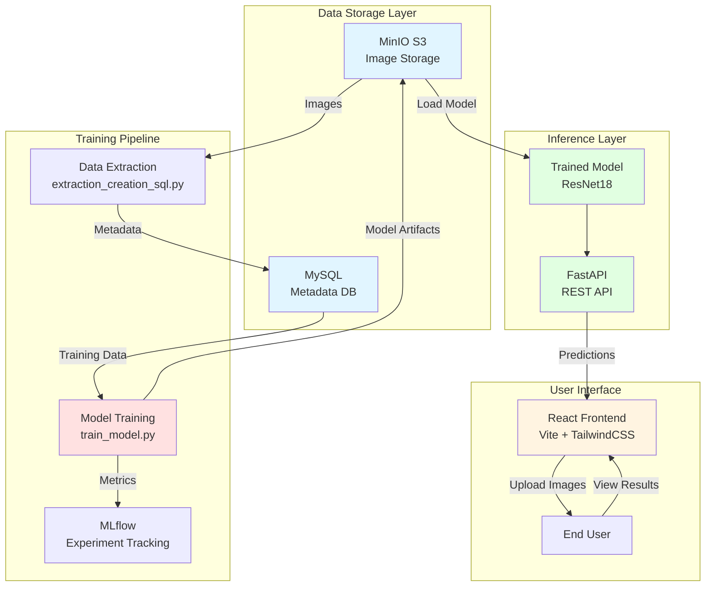

<!-- Slide 1 -->
# 🐟 Fish Classification MLOps Project

**A Complete End-to-End Machine Learning Pipeline**

Classification of 5 fish species using PyTorch ResNet18
with production-ready MLOps infrastructure

---

<!-- Slide 2 -->
## 🎯 Problem Statement & Solution

### **Problem**
- Need to automatically classify fish species from images
- 5 species to identify: Catfish, Gold Fish, Mudfish, Mullet, Snakehead
- Manual classification is time-consuming and error-prone
- Requires a scalable, production-ready solution

### **Solution**
- Deep Learning model (ResNet18) with transfer learning
- Automated MLOps pipeline for training and deployment
- RESTful API for real-time predictions
- Web interface for easy interaction
- **Results:** 84.21% validation accuracy, ~70-100% test accuracy

---

<!-- Slide 3 -->
## �️ Technology Stack

| Component | Tool Chosen | Why It's Better |
|-----------|-------------|-----------------|
| **Object Storage** | **MinIO** | Self-hosted S3-compatible storage. Free and perfect for local development, unlike AWS S3 which requires cloud account and costs per usage. |
| **Database** | **MySQL** | Industry-standard relational database with excellent Docker support and huge community. Reliable for structured metadata storage. |
| **ML Framework** | **PyTorch** | Most intuitive API with native dynamic graphs. Excellent for transfer learning via torchvision. Research-friendly with easy debugging. |
| **API Framework** | **FastAPI** | Modern async framework with automatic Swagger documentation and built-in Pydantic validation. Faster than Flask/Django with less boilerplate. |
| **Frontend** | **React + Vite** | Instant HMR and lightning-fast builds. Huge ecosystem and industry standard with better performance than traditional webpack setups. |
| **Orchestration** | **Docker Compose** | Simple YAML configuration perfect for single-host deployment. Setup in minutes vs hours/days for Kubernetes. |
| **Experiment Tracking** | **MLflow** | Open-source and self-hosted with model registry. Framework-agnostic unlike TensorBoard. No cloud dependency like W&B. |

---

<!-- Slide 4 -->
## 📊 Project Architecture



### **Architecture Components:**

**🗄️ Data Storage Layer:** Foundation for all data persistence - MinIO stores raw images and trained models (S3-compatible), while MySQL holds structured metadata for efficient querying.

**🔄 Training Pipeline:** Offline workflow that runs periodically - extracts data from storage, trains the model with PyTorch, and logs all experiments to MLflow for reproducibility.

**🚀 Inference Layer:** Production serving components - loads the trained model and exposes it via FastAPI REST endpoints for real-time predictions.

**👤 User Interface:** Customer-facing layer - React frontend provides an intuitive way for end users to upload images and receive classification results instantly.

---

<!-- Slide 5 -->
## � Data Storage Layer

### **MinIO (Object Storage)**
- S3-compatible object storage for images and model artifacts
- Stores 1,306 fish images (train/val/test splits)
- Stores trained model files (.pt files)
- Accessible via web console at port 9001

### **MySQL (Metadata Database)**
- Stores image metadata (path, species, split type)
- Table structure: `fish_data` with columns for ID, path, label, split
- Enables efficient data querying during training
- phpMyAdmin interface for easy database management

**Why This Combination?**
Separates concerns: unstructured data (images) in MinIO, structured metadata in MySQL. Scalable and follows industry best practices.

---

<!-- Slide 6 -->
## � Data Extraction Pipeline

### **extraction_creation_sql.py**
```python
# Key functions:
1. Connect to MinIO and MySQL
2. Scan bucket for images
3. Extract metadata (filename, species, split)
4. Create SQL table if not exists
5. Insert records into MySQL
```

**Process:**
1. Lists all images from MinIO bucket `dataset-fish`
2. Parses folder structure (train/val/test/species)
3. Creates MySQL table with proper schema
4. Populates database with image metadata

**Dependencies:**
- Waits for MinIO and MySQL to be healthy before running
- Runs once at setup to prepare data for training

---

<!-- Slide 7 -->
## 🎓 Model Training Pipeline

### **train_model.py**
**Architecture:** ResNet18 (pretrained on ImageNet)
- Transfer learning: freeze early layers, fine-tune final classifier
- Modified final layer for 5 classes (fish species)

**Training Process:**
1. Query MySQL for image paths and labels
2. Download images from MinIO to local storage
3. Apply data transformations (resize, normalize)
4. Train for 20 epochs with Adam optimizer
5. Track metrics with MLflow
6. Save best model back to MinIO

**Results:**
- Validation Accuracy: 84.21%
- Automatic model versioning with timestamps

---

<!-- Slide 8 -->
## 📈 Experiment Tracking with MLflow

### **What MLflow Does:**
- Logs hyperparameters (epochs, batch size, learning rate)
- Tracks training/validation metrics per epoch
- Stores model artifacts and metadata
- Provides web UI for experiment comparison

### **Integration:**
```python
mlflow.log_param("epochs", 20)
mlflow.log_metric("val_accuracy", accuracy)
mlflow.pytorch.log_model(model, "model")
```

**Benefits:**
- Compare different training runs
- Reproduce experiments easily
- Track model lineage and versioning
- Self-hosted: no data leaves your infrastructure

---

<!-- Slide 9 -->
## 🚀 Inference API (FastAPI)

### **app/main.py**
```python
@app.post("/predict")
async def classify(file: UploadFile):
    # 1. Receive image from user
    # 2. Load from MinIO
    # 3. Apply same preprocessing as training
    # 4. Run inference
    # 5. Return prediction + confidence
```

**Features:**
- Automatic OpenAPI/Swagger documentation
- CORS enabled for frontend communication
- Async processing for better performance
- Error handling with proper HTTP status codes

**Endpoints:**
- `GET /` - Health check
- `POST /predict` - Image classification
- `GET /docs` - Interactive API documentation

---

<!-- Slide 10 -->
## ⚛️ Frontend Interface (React + Vite)

### **User Experience:**
- Drag & drop or click to upload fish images
- Real-time prediction with confidence scores
- Beautiful aquatic-themed animations (swimming fish, bubbles)
- Responsive design with TailwindCSS

### **Technical Features:**
- Vite for instant Hot Module Replacement (HMR)
- Component-based architecture:
  - `ImageUploader.jsx` - File upload handling
  - `ResultDisplay.jsx` - Show predictions
  - `SwimmingFish.jsx` & `Bubbles.jsx` - Animations
- API integration via fetch to FastAPI backend

**Development Speed:**
Vite's instant HMR makes development 10x faster than traditional webpack setups.

---

<!-- Slide 11 -->
## 🐳 Docker Compose Orchestration

### **7 Services Working Together:**
1. **MinIO** - Object storage (ports 9000, 9001)
2. **MySQL** - Database (port 3306)
3. **phpMyAdmin** - DB interface (port 8080)
4. **MLflow** - Experiment tracking (port 5001)
5. **extraction** - Data preparation (runs once)
6. **training** - Model training (runs once)
7. **fish_api** - FastAPI backend (port 8000)
8. **frontend** - React UI (port 3000)

### **Orchestration Features:**
- Health checks ensure services start in correct order
- Dependency management (`depends_on`)
- Shared network for inter-service communication
- Volume persistence for data and models

---

<!-- Slide 12 -->
## 🎬 Live Demo

### **Starting the Application:**
```bash
# Start entire infrastructure
docker-compose up -d

# Check service status
docker-compose ps
```

### **Using the Application:**
1. Open http://localhost:3000 (Frontend)
2. Upload a fish image
3. Get instant prediction with confidence score

### **API Testing:**
```bash
curl -X POST "http://localhost:8000/predict" \
  -F "file=@test_fish.jpg"

# Response:
{
  "prediction": "Gold Fish",
  "confidence": 94.27
}
```

### **Monitoring:**
- MLflow UI: http://localhost:5001 - View training metrics
- MinIO Console: http://localhost:9001 - Browse stored files
- phpMyAdmin: http://localhost:8080 - Query database

---

<!-- Slide 13 -->
## 🎓 Conclusion

### **What We Achieved:**
✅ **End-to-end MLOps pipeline** from data storage to deployment  
✅ **84.21% validation accuracy** on fish species classification  
✅ **Production-ready infrastructure** with Docker containerization  
✅ **Automated workflows** with dependency management  
✅ **User-friendly interface** for non-technical users  
✅ **Experiment tracking** for reproducibility  

### **Key Learnings:**
1. **Separation of concerns:** Storage, training, and inference as independent services
2. **Infrastructure as Code:** Entire system reproducible via docker-compose.yml
3. **Best practices:** Model versioning, API documentation, experiment tracking
4. **Scalability:** Architecture ready for cloud deployment (K8s, AWS, etc.)

### **Real-world Applications:**
This pipeline can be adapted for any image classification task in production environments.

**Thank you!** 🐟

